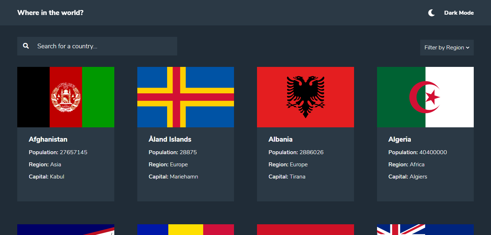
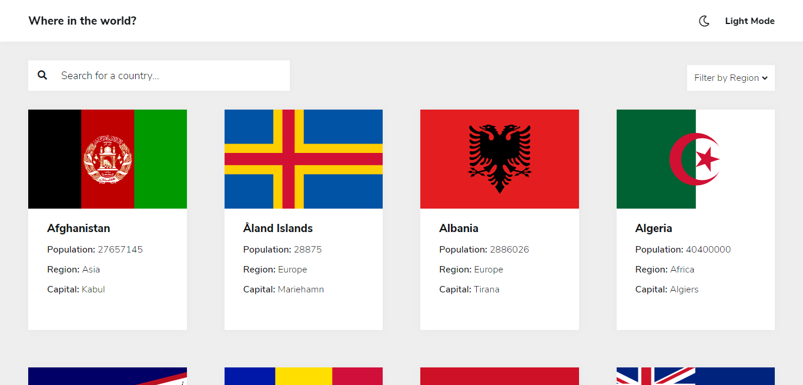
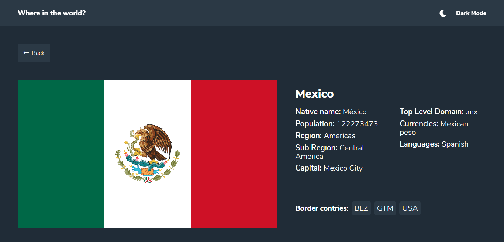
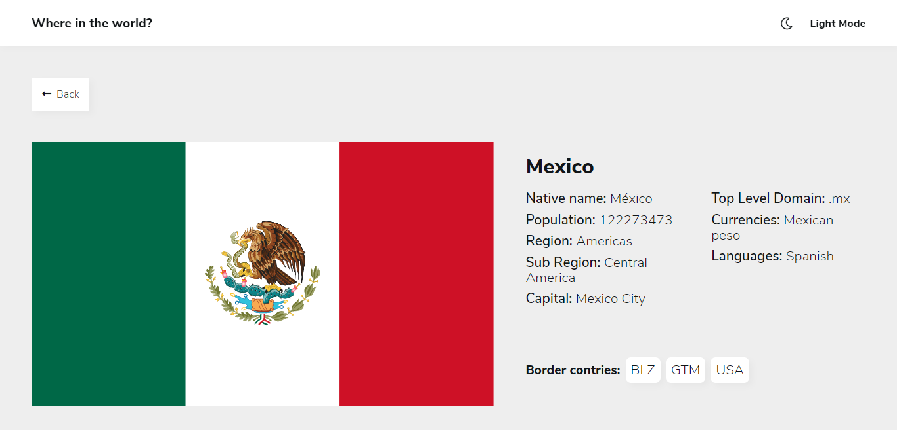

# Frontend Mentor - REST Countries API with color theme switcher solution

This is a solution to the [REST Countries API with color theme switcher challenge on Frontend Mentor](https://www.frontendmentor.io/challenges/rest-countries-api-with-color-theme-switcher-5cacc469fec04111f7b848ca). Frontend Mentor challenges help you improve your coding skills by building realistic projects.

## Table of contents

- [Overview](#overview)
  - [The challenge](#the-challenge)
  - [Screenshot](#screenshots)
  - [Links](#links)
- [My process](#my-process)
  - [Built with](#built-with)
  - [Useful resources](#useful-resources)
- [Author](#author)

## Overview

### The challenge

Users should be able to:

- See all countries from the API on the homepage
- Search for a country using an `input` field
- Filter countries by region
- Click on a country to see more detailed information on a separate page
- Click through to the border countries on the detail page
- Toggle the color scheme between light and dark mode _(optional)_

## screenshots

### Home page dark theme

### Home page light theme

### Country page dark theme

### Country page light theme

### Links

- Solution URL: [Link](https://github.com/LuisFernandoLG/REST-Countries-API)
- Live Site URL: [Link](https://countries-api-rest.netlify.app/)

## My process

### Built with

- Flexbox
- CSS Grid
- [React](https://reactjs.org/) - JS library
- [Styled Components](https://styled-components.com/) - For styles
- [Fontawesome](https://fontawesome.com/) - for icons
- [Google Fonts](https://fonts.google.com/specimen/Nunito+Sans) - Font Nunito Sans

### Useful resources

- [Blog of Jonmircha about react](https://jonmircha.com/react) - This blog helped me a lot to understand things such as state and hooks.

## Author

- Frontend Mentor - [@luisLopezLG](https://www.frontendmentor.io/profile/LuisFernandoLG)
- Instagram - [@luislopezl.g](https://www.instagram.com/luislopezl.g/)
